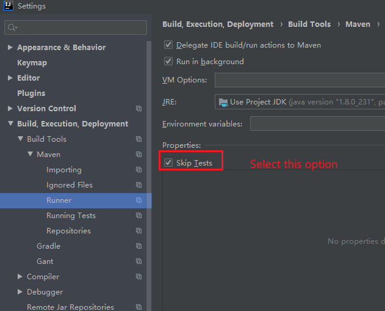
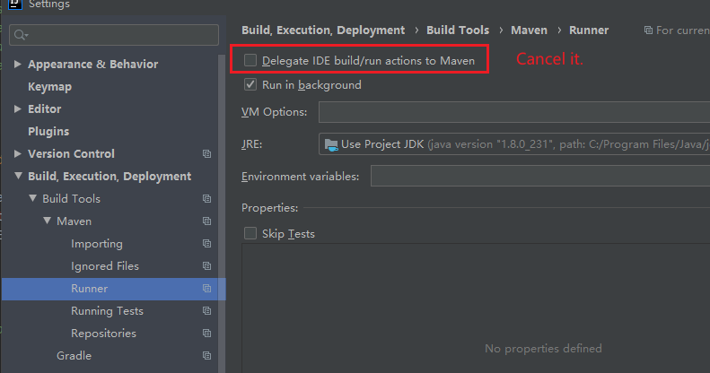
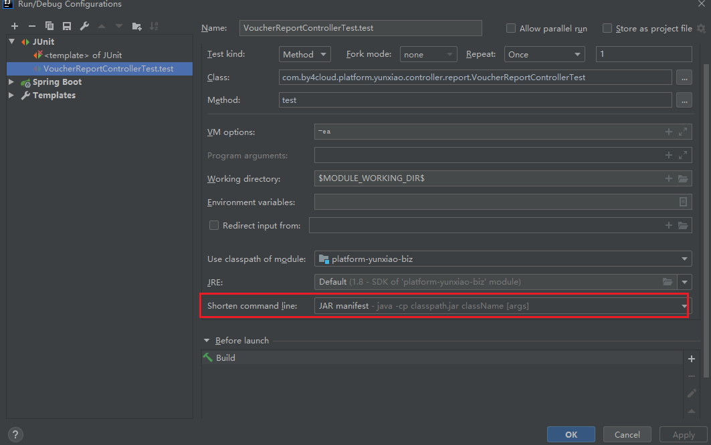

#### 1, Run an individual test in Idea.

If you don't want to all the tests run in a class when you are trying to run a single test of a method. You should select "Skip Tests".



**Or** cancel "Delegate IDE... to Maven "



#### 2, JUnit is not available 

JUnit is not available in a project run by Idea.

Error: 

```txt
org.junit.platform.commons.JUnitException: TestEngine with ID 'junit-jupiter' failed to discover tests
```

Solution:

The reason is as same as it in the 1.  Just deselect "Delegate IDE build..."

#### 3,  Errors of Unit Test

1, An error occurs in a project of Idea. The exception is as follows.

```txt
command line is too long  also for junit
```

Solution:

In "Shorten command line" select JAR manifest.

