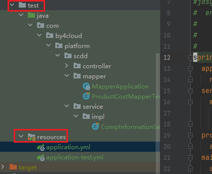
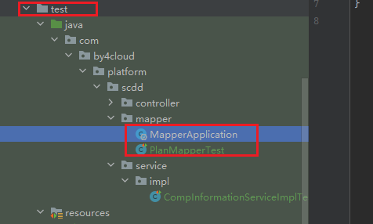

### 1,  Skip test in Maven

If you don't want to run all the tests, you could skip test in the building process of Maven.

### 2, Package name of class and its test class

The class and its test class must have the same package name  or errors will be caused.

### 3, Using Unit Test with MyBatis and MyBatis Plus

#### 3.1, MyBatis Plus

(1) Import the dependency of MyBatis Plus Test.

```xml
		<!-- MyBatis Plus Test -->
		<dependency>
			<groupId>com.baomidou</groupId>
			<artifactId>mybatis-plus-boot-starter-test</artifactId>
			<version>3.5.7</version>
			<scope>test</scope>
		</dependency>
```

(2) Create configuration files in the `/resources` in`test` module.



`application.yml`

```yaml
spring:
  application:
    name: scdd
  servlet:
    multipart:
      max-file-size: 100MB
      max-request-size: 100MB
  profiles:
    active: test   # active the test profile or use @@ActiveProfiles on the test class.
  main:
    allow-bean-definition-overriding: true
    
# mybatis-plus 配置
mybatis-plus:
  mapper-locations: classpath*:/mapper/*Mapper.xml
  global-config:
    banner: false
    db-config:
      id-type: auto
      where-strategy: not_empty
      insert-strategy: not_empty
      update-strategy: not_null
  type-handlers-package: com.by4cloud.platform.common.data.handler
  configuration:
    jdbc-type-for-null: 'null'
    call-setters-on-nulls: true
```

`application-test.yml` : I don't use `Druid DataSource` right now until I know how to use it in unit test.

```yaml
# 数据源
spring:
  redis:
    host: 127.0.0.1
    database: 7 
  datasource:
    driver-class-name: com.mysql.cj.jdbc.Driver
    username: root
    password: root
    url: jdbc:mysql://192.168.0.159:3306/platformx_boot_scdd?characterEncoding=utf8&zeroDateTimeBehavior=convertToNull&useSSL=false&useJDBCCompliantTimezoneShift=true&useLegacyDatetimeCode=false&serverTimezone=GMT%2B8&allowMultiQueries=true&allowPublicKeyRetrieval=true
```

(3) Create a test class and an mapper application class at the same directory.

`PlanMapperTest`

```java
@MybatisPlusTest
// Conntect the database configured,which is MySQL or HSSQL, in the application-test.yml.
@AutoConfigureTestDatabase(replace = AutoConfigureTestDatabase.Replace.NONE)    
/*If you set 'active: test' in `application.yml`, the following annotation is not necessary*/ 
//@ActiveProfiles("test")  
public class PlanMapperTest {
	@Autowired
	private ProductPlanOutputMapper  planOutputMapper;
    
	@Test
	public void testFindById() throws Exception {
		ProductPlanOutput plan = planOutputMapper.selectById(1697182294512558082L);
		assertNotNull(plan);
	}

	@Test
	public void testSumGroupDailyPlan() throws Exception {
		DateTime date = DateUtil.parse("2023-09-01", "yyyy-MM-dd");
		AnnualMonthDailyPlanV sumPlan = planOutputMapper.sumGroupDailyPlan(date, "3", "0203");
		assertNotNull(sumPlan);
	}
```

`MapperApplication` : Prevent detecting a real `@SpringBootApplication.`



```java
import org.springframework.boot.autoconfigure.SpringBootApplication;

@SpringBootApplication
public class MapperApplication {
}
```

#### 3.2 My Batis

[Unit Test with MyBatis](https://mybatis.org/spring-boot-starter/mybatis-spring-boot-test-autoconfigure/)

